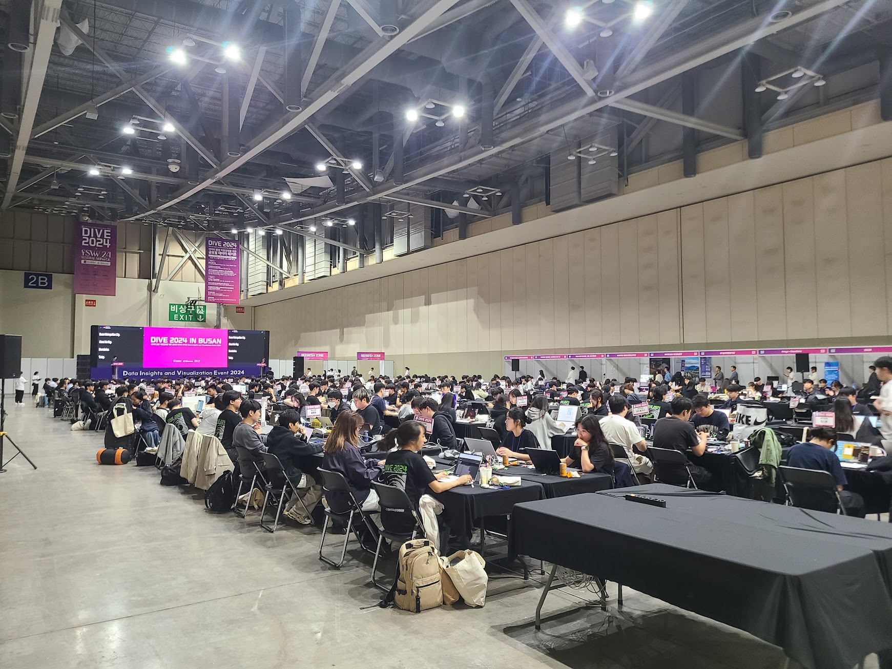

## 문제 1

Q: 다음 이미지에 대한 설명 중 옳지 않은 것은 무엇인가요?

- (1) 행사장이 많은 사람들로 가득 차 있습니다.
- (2) 천장에 여러 개의 조명이 설치되어 있습니다.
- (3) 모든 사람들은 노트북을 사용하고 있습니다.
- (4) 배경에 큰 스크린이 보입니다.

Listening: Which of the following descriptions of the image is incorrect?

- (1) The event hall is filled with many people.
- (2) There are multiple lights installed on the ceiling.
- (3) Everyone is using a laptop.
- (4) There is a large screen in the background.

정답: (3) 모든 사람들은 노트북을 사용하고 있지 않습니다.

---------------------

## 문제 2

Q: 다음 이미지에 대한 설명 중 옳지 않은 것은 무엇인가요?
- (1) 노란색 조형물이 이미지의 왼쪽에 위치해 있습니다.
- (2) 'Local Stitch'라는 글자가 보이는 건물이 있습니다.
- (3) 건물의 외벽은 대부분 회색으로 되어 있습니다.
- (4) 이미지에는 실내 장면이 포함되어 있습니다.

Listening: Which of the following descriptions of the image is incorrect?
- (1) A yellow sculpture is located on the left side of the image.
- (2) There is a building with the words 'Local Stitch' on it.
- (3) Most of the building's exterior walls are gray.
- (4) The image includes an indoor scene.

정답: (4) 이미지에는 실내 장면이 아닌 야외 장면이 포함되어 있습니다.

---------------------

## 문제 3

Q: 다음 이미지에 대한 설명 중 옳지 않은 것은 무엇인가요?
- (1) 카페의 일부는 바 테이블로 구성되어 있습니다.
- (2) 노란색 벽이 카페에 포인트를 주고 있습니다.
- (3) 테이블에 앉아 있는 많은 사람들이 보입니다.
- (4) 커피를 준비하는 직원이 있습니다.

Listening: Which of the following descriptions of the image is incorrect?
- (1) Part of the café is made up of a bar table.
- (2) A yellow wall adds a point to the café.
- (3) There are many people sitting at the tables.
- (4) There is a staff member preparing coffee.

정답: (3) 테이블에 앉아 있는 많은 사람들이 보이지 않습니다.

---------------------

## 문제 4

Q: 다음 이미지에 대한 설명 중 옳지 않은 것은 무엇인가요?
- (1) 건물의 외벽은 붉은색 벽돌로 이루어져 있습니다.
- (2) 건물 앞에 주황색 원뿔이 놓여 있습니다.
- (3) 아래층 창문에 "PERSONAL COFFEE"라는 글자가 보입니다.
- (4) 건물은 단층 구조입니다.

Listening: Which of the following descriptions of the image is incorrect?
- (1) The exterior wall of the building is made of red bricks.
- (2) There is an orange cone in front of the building.
- (3) The lower floor window shows the words "PERSONAL COFFEE."
- (4) The building has a single-story structure.

정답: (4) 건물은 단층 구조가 아닌 여러 층이 있습니다.

---------------------

## 문제 5

**Q: 다음 이미지에 대한 설명 중 옳지 않은 것은 무엇인가요?**

- (1) 다양한 종류의 빵이 진열되어 있습니다.
- (2) 진열대 뒤에 있는 사람은 모자를 쓰고 있습니다.
- (3) 빵의 가격이 명확하게 표시되어 있습니다.
- (4) 진열대 위에 케이크가 놓여 있습니다.

**Listening: Which of the following descriptions of the image is incorrect?**

- (1) Various types of bread are displayed.
- (2) The person behind the counter is wearing a hat.
- (3) The prices of the bread are clearly marked.
- (4) There is a cake placed on top of the display.

**정답: (4) 진열대 위에 케이크가 놓여 있지 않습니다.**

---------------------

## 문제 6

Q: 다음 이미지에 대한 설명 중 옳지 않은 것은 무엇인가요?
- (1) 작업자들이 철제 구조물을 설치하고 있습니다.
- (2) "뉴트리코어"라는 간판이 보입니다.
- (3) 나무가 건물 앞에 심어져 있습니다.
- (4) 사람들이 카페에 줄을 서서 기다리고 있습니다.

Listening: Which of the following descriptions of the image is incorrect?
- (1) Workers are installing a metal structure.
- (2) There's a sign that says "뉴트리코어."
- (3) A tree is planted in front of the building.
- (4) People are lined up waiting at the café.

정답: (4) 사람들이 카페에 줄을 서서 기다리고 있는 모습은 없습니다.

---------------------

## 문제 7

Q: 다음 이미지에 대한 설명 중 옳지 않은 것은 무엇인가요?
- (1) 사람들이 카페에서 테이블에 앉아 있습니다.
- (2) 바닥은 나무로 되어 있습니다.
- (3) 창문을 통해 햇빛이 들어오고 있습니다.
- (4) 방에 사람이 한 명도 없습니다.

Listening: Which of the following descriptions of the image is incorrect?
- (1) People are sitting at tables in a café.
- (2) The floor is made of wood.
- (3) Sunlight is coming through the windows.
- (4) There is no one in the room.

정답: (4) 방에는 여러 사람이 있습니다.

---------------------

## 문제 8

Q: 다음 이미지에 대한 설명 중 옳지 않은 것은 무엇인가요?
- (1) 사람들이 대형 버스에 짐을 싣고 있습니다.
- (2) 이미지 왼쪽에 'COFFEE & BAKERY'라는 글씨가 보입니다.
- (3) 사람들은 대형 건물 앞에서 기다리고 있습니다.
- (4) 모든 사람들이 버스를 타기 위해 줄 서 있습니다.

Listening: Which of the following descriptions of the image is incorrect?
- (1) People are loading luggage onto a large bus.
- (2) The words 'COFFEE & BAKERY' are visible on the left side of the image.
- (3) People are waiting in front of a large building.
- (4) Everyone is lined up to board the bus.

정답: (4) 모든 사람들이 버스를 타기 위해 줄 서 있는 것은 아닙니다.

---------------------

